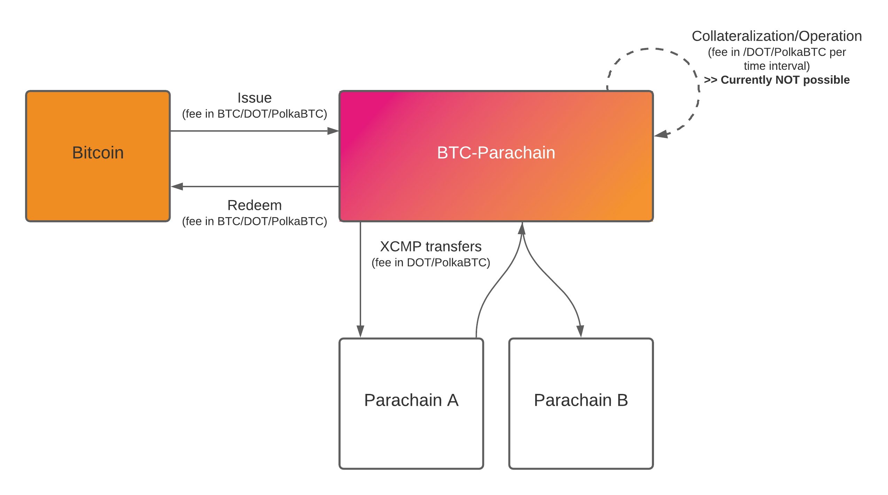

.. _fee_model:

Fee Model
=========

We assume Vaults and Staked Relayer to be economically driven, i.e., following a strategy to maximize profits over time. While there may be altruistic actors, who follow protocol rules independent of the economic impact, we do not consider these here.

Byzantine actors aim to manipulate the system and cause damage to users - independent of the economic impact this has on them. To showcase how misbehavior impacts the fees earned by participants, we also consider byzantine behavior of Vaults and Staked Relayers in this analysis.

Currencies
~~~~~~~~~~

The BTC-Parachain features three assets:

- `BTC` - the backing-asset (locked on Bitcoin)
- `ONEBTC` - the issued cryptocurrency-backed asset (on Harmony)
- `ONE` - the currency used as collateral (`ONE` used initially but may later be replaced with a stablecoin, currency-set, or similar)

Actors: Income and Real/Opportunity Costs
~~~~~~~~~~~~~~~~~~~~~~~~~~~~~~~~~~~~~~~~~

The main question when designing the fee model for ONEBTC is: When are fees paid, by whom, and how much?

  High-level overview of fee accrual in the BTC-Parachain (external sources only).

Below, we hence overview the income and cost sources for each actor/stakeholder in the BTC-Parachain.
Thereby, we differentiate between the following cost types:

- **Internal costs**: costs associated directly with the BTC-Parachain (i.e., inflow or internal flow of funds)
- **External costs**: costs associated with external factors, such as node operation, engineering costs etc. (i.e., outflow of funds)
- **Opportunity costs**: lost revenue, if e.g. locked up collateral was to be used in other applications (e.g. to stake on the Relay chain)

Users
-----

- **Income**

  - Slashed collateral
  - Use of ONEBTC in applications

- **Internal Cost**

  - Issue and redeem fees
  - BTC-Relay fees
  - Parachain transaction fees

- **External Costs**

  - *None*

- **Opportunity Cost**

  - BTC lockup

Vaults
------

- **Income**

  - Issue and redeem fees
  - SLA-based subsidy

- **Internal Cost**

  - BTC-Relay fee
  - Parachain transaction fees
  - (Upon failure: Slashed collateral)

- **External Costs**

  - *None*

- **Opportunity Cost**

  - Backing-collateral lockup

Staked Relayers
---------------

- **Income**

  - SLA-based subsidy
  - BTC-Relay fees

- **Internal Cost**

  - Parachain transaction fees (offset against BTC-Relay fees)
  - (Upon failure: Slashed collateral)

- **External Costs**

  - Parachain node operation/maintenance costs
  - Bitcoin full node operation/maintenance costs

- **Opportunity Cost**

  - Staking-collateral lockup

Collators
---------

- **Income**

  - Transaction fees
  - Parachain subsidy (SLA-based?)

- **Internal Cost**

  - *None*

- **External Costs**

  - Parachain node operation/maintenance costs

- **Opportunity Cost**

  - Staking-collateral lockup

Maintainers
-----------

- **Income**

  - Parachain subsidy (revenue share)
  - Upgrade/extension/maintenance fee

- **Internal Cost**

  - *None*

- **External Costs**

  - Server maintenance (UI, etc.)
  - Operational/developer costs

- **Opportunity Cost**

  - Other bridges

Payment flows
~~~~~~~~~~~~~

We detail the payment flows in the figure below:

.. figure:: ../figures/fee-payment-flows.png
  :alt: Payment flows

  Detailed overview of fee accrual in the BTC-Parachain, showing external and internal payment flows, as well as opportunity costs.

Challenges Around Economic Efficiency
~~~~~~~~~~~~~~~~~~~~~~~~~~~~~~~~~~~~~

To ensure security of ONEBTC, i.e., that users never face financial damage, XCLAIM relies on collateral. However, in the current design, this leads to the following economic challenges:

- **Over-collateralization**. Vaults must lock up significantly (e.g. 200%) more collateral than minted ONEBTC to ensure security against exchange rate fluctuations. Dynamically modifying the exchange rate could only marginally reduce this requirement, at a high computational overhead. As such, to issue 1 ONEBTC, one must lock up 1 BTC, as well as the 2 BTC worth of collateral (e.g. in ONE), resulting in a 300% collateralization.

- **Non-deterministic Collateral Lockup**. When a Vault locks collateral to secure ONEBTC, it does not know for how long this collateral will remain locked up. As such, it nearly impossible to determine a fair price for the premium charged to the user, without putting either the user or the Vault at a disadvantage.

- **Limited Chargeable Events**. The Vault only has two events during which it can charge fees: (1) fulfillment of and issue request and (2) fulfillment of a redeem request. Thereby, the fees charged for the redeem request must be **upper-bounded** for security reasons (to prevent extortion by the Vault via sky-rocketing redeem fees).

As such, an open research question is:

*What is the value of a Vault's locked collateral at any given point in time, considering the value of the collateral currency, the value of locked BTC, the value of ONEBTC (if different from BTC), as well as the projected earning from fees over time?*

Subsidizing Vault Collateral Costs
~~~~~~~~~~~~~~~~~~~~~~~~~~~~~~~~~~

- **Higher user fees for issue/redeem** to ensure sufficiently good economic performance of Vaults to incentivize participation. Ideally, this would be combined with a supply/demand-based market for ONEBTC, driven by Parachains/applications on Harmony (see below). The risk for (both) this model is that high fees may impede adoption if users revert to cheaper, yet centralized solutions.
- **XCMP fees from other Parachains**. Charge Parachains additional fees for getting access to ONEBTC, creating an supply/demand-based market for ONEBTC access. The more demand for ONEBTC, the higher the market price, the more BTC will be locked to mint ONEBTC. However, this (i) impedes adoption by other Parachains and (ii) results in clear price deviations between ONEBTC and BTC in times of ONEBTC shortage. The latter may not be a bad thing per se, yet may have an unexpected effect for applications using ONEBTC.
- **Harmony treasury subsidy** to Vaults (and Staked Relayers) on a on a continuous basis, subject to correct operation / collateral usage, to account for the opportunity costs of the Vault accrued through locking up collateral.
- **Governance token model**, where tokens are allocated to Vaults on a continuous basis, subject to correct operation / collateral usage. The token model, however, needs careful consideration and a clear use case (in addition to voting).
- **On-demand collateral model via XCLAIM-Commit**, where Vaults lock up collateral only for short, deterministic periods and can hence compute an accurate fee model. In addition, users can request additional collateralization for specific periods and pay for collateral on demand. However, XCLAIM-Commit is still WIP and incurs stricter liveness requirements and a significantly more involved process for maintaining the secure 1:1 backing for Vaults.

Any of the above solutions can be implemented by themselves, or in combination - most likely, a mix of all will lead to the most well-balanced model.

Other considerations
~~~~~~~~~~~~~~~~~~~~

- **Vault-User BTC Call Options / Perpetuals**: When a user locks BTC with the Vault, he implicitly sells a BTC call option to the Vault. The Vault can, at any point in time, decide to exercise this option by "stealing" the user's BTC. The price for this option is determined by *spot_price + punishment_fee* (*punishment_fee* is essentially the option premium). The main issue here is that we do not know how to price this option, because it has no expiry date - so this deal between the User and the Vault essentially becomes a **BTC perpetual that can be physically exercised at any point in time (American-style)**.