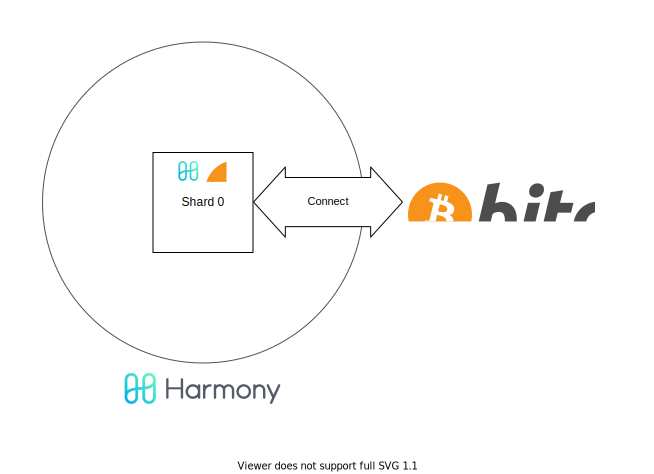
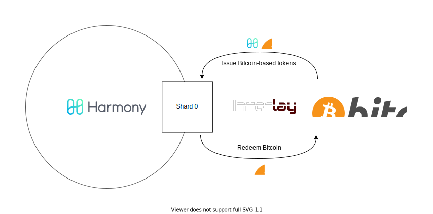

BTC Bridge at a Glance
=========================

The *BTC Bridge* connects the Harmony ecosystem with Bitcoin.
It allows the creation of *ONEBTC*, a fungible token that represents Bitcoin in the Harmony ecosystem.
ONEBTC is backed by Bitcoin 1:1 and allows redeeming of the equivalent amount of Bitcoins by relying on a collateralized third-party.

     The BTC Bridge allows the creation of collateralized 1:1 Bitcoin-backed tokens in Harmony. These tokens can be transfered and traded within the Harmony ecosystem.

Functionality
-------------

On a high-level, the BTC Bridge enables the issuing and redeeming of ONEBTC.
The *issue process* allows a user to lock Bitcoin on the Bitcoin chain and, in return, issue ONEBTC on the BTC Bridge.
Consequently, the *redeem process* allows a user to burn ONEBTC on the BTC Bridge and redeem previously locked Bitcoins on Bitcoin.
Users can trade ONEBTC on the BTC Bridge and, through Harmony, in other shards as well.
The issue and redeem process can be executed by different users.
Typically, this process is augmented by a collateralized realized third-party, a so-called *vault*.

     The BTC Bridge includes a protocol to issue ONEBTC by locking Bitcoin and a protocol to redeem Bitcoin by burning ONEBTC tokens.

Components
----------

The BTC Bridge makes use of two main components to achieve issuing and redeeming of ONEBTC:

+ **XCLAIM(BTC,ONE)**: The XCLAIM(BTC,ONE) component implements four protocols including issue, transfer, redeem, and replace. It maintains the ONEBTC tokens, i.e. who owns how many tokens and manages the vaults as well as the collateral in the system.
+ **BTC-Relay**: The BTC-Relay component is used to verify that certain transactions have happened on the Bitcoin blockchain. For example, when a user issues a new ONEBTC an equivalent amount of Bitcoins needs to be locked on the Bitcoin chain. The user can prove this to the ONEBTC component by verifying his transaction in the BTC-Relay component.

The figure below describes the relationships between the components in a high level. Please note that we use a simplified model here, where users are the ones augmenting the issue and redeem process. In practice, this is executed by the collateralized vaults.

.. figure:: ../figures/Overview-Components.svg
      :alt: BTC Bridge components.

      The BTC Bridge consists of two logically different components. The XCLAIM(BTC,ONE) component (in green) maintains the accounts that own ONEBTC tokens. The BTC-Relay (blue) is repsonible for verifying the Bitcoin state to verify transactions. Users (in pink) are able to create new ONEBTC by locking BTC on the Bitcoin chain and redeeming BTC by burning ONEBTC. Also, users can trade ONEBTC on the BTC Bridge and in the wider Harmony ecosystem.
