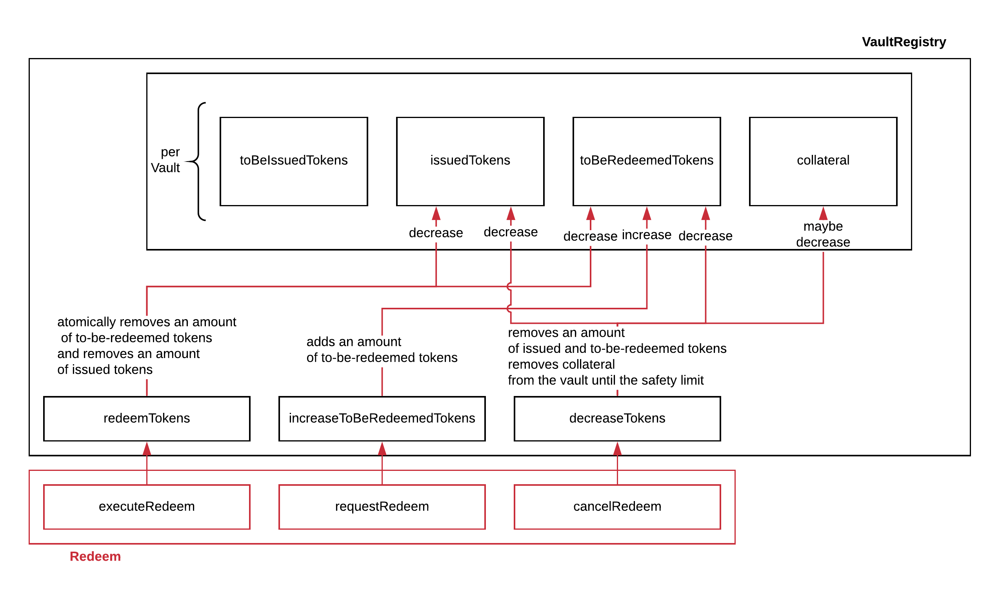

.. _redeem-protocol:

Redeem
======

Overview
~~~~~~~~

The redeem module allows a user to receive BTC on the Bitcoin chain in return for destroying an equivalent amount of ONEBTC on the BTC Bridge. The process is initiated by a user requesting a redeem with a vault. The vault then needs to send BTC to the user within a given time limit. Next, the vault has to finalize the process by providing a proof to the BTC Bridge that he has send the right amount of BTC to the user. If the vault fails to deliver a valid proof within the time limit, the user can claim an equivalent amount of ONE from the vault's locked collateral to reimburse him for his loss in BTC.

Moreover, as part of the liquidation procedure, users are able to directly exchange ONEBTC for ONE. To this end, a user is able to execute a special liquidation redeem if one or multiple vaults have been liquidated.

Step-by-step
------------

1. Precondition: A user owns ONEBTC.
2. A user locks an amount of ONEBTC by calling the :ref:`requestRedeem` function. In this function call, the user selects a vault to execute the redeem request from the list of vaults. The function creates a redeem request with a unique hash.
3. The selected vault listens for the ``RequestRedeem`` event emitted by the user. The vault then proceeds to transfer BTC to the address specified by the user in the :ref:`requestRedeem` function including a unique hash in the ``OP_RETURN`` of one output.
4. The vault executes the :ref:`executeRedeem` function by providing the Bitcoin transaction from step 3 together with the redeem request identifier within the time limit. If the function completes successfully, the locked ONEBTC are destroyed and the user received its BTC.
5. Optional: If the user could not receive BTC within the given time (as required in step 4), the user calls :ref:`cancelRedeem` after the redeem time limit. The user is then refunded with the ONE collateral the vault provided.
6. Optional: If one or more vaults are liquidated, a user can execute a :ref:`liquidationRedeem`.

Security
--------

- Unique identification of Bitcoin payments: :ref:`op-return`

Vault Registry
--------------

The data access and state changes to the vault registry are documented in :numref:`fig-vault-registry-redeem` below.

.. _fig-vault-registry-redeem:

    The redeem module interacts through three different functions with the vault registry.

Fee Model
---------

Following additions are added if the fee model is integrated.

- Redeem fees are paid by users in ONEBTC when executing the request. The fees are transferred to Bridge Fee Pool.
- If a redeem request is canceled, the user has two choices:
    - If the user selects to reimburse, the ONE equivalent of ONEBTC at the current exchange rate plus the punishment fee is deducted from the vault and transferred to the user.
    - If the user does not reimburse, the punishment fee is deducted from the vaults collateral and transferred to the user.
    - NOTE: with the SLA model additions, the punishment fee paid to the user stays constant (i.e., the user always receives the punishment fee of e.g. 10%). However, vaults may be slashed more than the punishment fee, as determined by the SLA. The surplus slashed collateral is routed into the Bridge Fee pool and handled like regular fee income. For example, if the vault is punished with 20%, 10% punishment fee is paid to the user and 10% is paid to the fee pool.

Data Model
~~~~~~~~~~

Scalars
-------

RedeemPeriod
............

The time difference between when a redeem request is created and required completion time by a vault. Concretely, this period is the amount by which :ref:`activeBlockCount` is allowed to increase before the redeem is considered to be expired. The period has an upper limit to ensure the user gets his BTC in time and to potentially punish a vault for inactivity or stealing BTC.

Maps
----

RedeemRequests
...............

Users create redeem requests to receive BTC in return for ONEBTC. This mapping provides access from a unique hash ``redeemId`` to a ``Redeem`` struct. ``<redeemId, Redeem>``.

Structs
-------

Redeem
......

Stores the status and information about a single redeem request.

.. tabularcolumns:: |l|l|L|

==================  ==========  =======================================================
Parameter           Type        Description
==================  ==========  =======================================================
``vault``           Account     The BTC Bridge address of the vault responsible for this redeem request.
``opentime``        u256        Block height of opening the request.
``amountONEBTC``    ONEBTC      Amount of ONEBTC the user requested to be redeemed.
``amountBTC``       BTC         Amount of BTC to be released to the user.
``amountONE``       ONE         Amount of ONE to be paid to the user from liquidated Vaults' collateral (when ``LIQUIDATION`` error indicated in :ref:`security`).
``premiumONE``      ONE         Amount of ONE to be paid as a premium to this user (if the Vault's collateral rate was below ``PremiumRedeemThreshold`` at the time of redeeming).
``redeemer``        Account     The BTC Bridge address of the user requesting the redeem.
``btcAddress``      bytes[20]   Base58 encoded Bitcoin public key of the User.
==================  ==========  =======================================================

Functions
~~~~~~~~~

.. _requestRedeem:

requestRedeem
--------------

A user requests to start the redeem procedure.
This function checks the BTC Bridge status in :ref:`security` and decides how the redeem process is to be executed.
The following modes are possible:

* **Normal Redeem** - no errors detected, full BTC value is to be Redeemed.
* **Premium Redeem** - the selected Vault's collateral rate has fallen below ``PremiumRedeemThreshold``. Full BTC value is to be redeemed, but the user is allocated a premium in ONE (``RedeemPremiumFee``), taken from the Vault's to-be-released collateral.

Specification
.............

*Function Signature*

``requestRedeem(redeemer, amountONEBTC, btcPublicKey, vault)``

*Parameters*

* ``redeemer``: address of the user triggering the redeem.
* ``amountONEBTC``: the amount of ONEBTC to destroy and BTC to receive.
* ``btcAddress``: the address to receive BTC.
* ``vault``: the vault selected for the redeem request.

*Returns*

* ``redeemId``: A unique hash identifying the redeem request.

*Events*

* ``RequestRedeem(redeemId, redeemer, amount, vault, btcAddress)``

*Errors*

* ``ERR_VAULT_NOT_FOUND = "There exists no vault with the given account id"``: The specified vault does not exist.
* ``ERR_AMOUNT_EXCEEDS_USER_BALANCE``: If the user is trying to redeem more BTC than his ONEBTC balance.
* ``ERR_AMOUNT_EXCEEDS_VAULT_BALANCE``: If the user is trying to redeem from a vault that has less BTC locked than requested for redeem.
* ``ERR_VAULT_BANNED = "The selected vault has been temporarily banned."``: Redeem requests are not possible with temporarily banned Vaults.

Preconditions
.............

* The BTC Bridge status in the :ref:`security` component must be set to ``RUNNING:0`` or to ``ERROR:1`` with ``Errors`` containing only ``LIQUIDATION``. All other states are disallowed.

Function Sequence
.................

1. Check if the ``amountONEBTC`` is less or equal to the user's balance in the treasury. Return ``ERR_AMOUNT_EXCEEDS_USER_BALANCE`` if this check fails.

2. Retrieve the ``vault`` from :ref:`vault-registry`. Return ``ERR_VAULT_NOT_FOUND`` if no vault can be found.

3. Check that the ``vault`` is currently not banned, i.e., ``vault.bannedUntil == None`` or ``vault.bannedUntil < current shard block height``. Return ``ERR_VAULT_BANNED`` if this check fails.

4. Check if the ``amountONEBTC`` is less or equal to the ``issuedTokens`` by the selected vault in the VaultRegistry. Return ``ERR_AMOUNT_EXCEEDS_VAULT_BALANCE`` if this check fails.

5. Check that the ``amountONEBTC`` is above the Bitcoin dust limit.

6. Call the :ref:`vault-registry` :ref:`increaseToBeRedeemedTokens` function with the ``amountBTC`` of tokens to be redeemed and the ``vault`` identified by its address.

7. Call the :ref:`lock` function in the Treasury to lock the ONEBTC ``amount`` of the user.

8. Generate a ``redeemId`` using :ref:`generateSecureId`, passing ``redeemer`` as parameter.

9. Check if the Vault's collateral rate is below ``PremiumRedeemThreshold``. If this is the case, set ``premiumONE = RedeemPremiumFee`` (as per :ref:`vault-registry`). Otherwise set ``premiumONE = 0``.

10. Store a new ``Redeem`` struct in the ``RedeemRequests`` mapping as ``RedeemRequests[redeemId] = redeem``, where:

    - ``redeem.vault`` is the requested ``vault``
    - ``redeem.opentime`` is the current block number
    - ``redeem.amountONEBTC`` is the ``amount`` provided as input
    - ``redeem.amountBTC = amountBTC``
    - ``redeem.amountONE = amountONE``
    - ``redeem.premiumONE = premiumONE``
    - ``redeem.redeemer`` is the redeemer account
    - ``redeem.btcAddress`` the Bitcoin address of the user.

11. Emit the ``RequestRedeem`` event with the ``redeemId``, ``redeemer`` account, ``amount``, ``vault``, and ``btcAddress``.

.. _liquidationRedeem:

liquidationRedeem
-----------------

A user executes a liquidation redeem that exchanges ONEBTC for ONE from the `LiquidationVault`. The BTC Bridge is in ``ERROR`` state with ``LIQUIDATION`` error code. The 1:1 backing is being recovered, hence this function burns ONEBTC without releasing any BTC. The user is also allocated the ``PunishmentFee`` in ONE as reimbursement for possible opportunity costs.

Specification
.............

*Function Signature*

``liquidationRedeem(redeemer, amountONEBTC)``

*Parameters*

* ``redeemer``: address of the user triggering the redeem.
* ``amountONEBTC``: the amount of ONEBTC to destroy.

*Returns*

* ``redeemId``: A unique hash identifying the redeem request.

*Events*

* ``RequestRedeem(redeemId, redeemer, amount, vault, btcAddress)``

*Errors*

* ``ERR_VAULT_NOT_FOUND = "There exists no vault with the given account id"``: The specified vault does not exist.
* ``ERR_AMOUNT_EXCEEDS_USER_BALANCE``: If the user is trying to redeem more BTC than his ONEBTC balance.
* ``ERR_AMOUNT_EXCEEDS_VAULT_BALANCE``: If the user is trying to redeem from a vault that has less BTC locked than requested for redeem.
* ``ERR_VAULT_BANNED = "The selected vault has been temporarily banned."``: Redeem requests are not possible with temporarily banned Vaults.

Preconditions
.............

* The BTC Bridge status in the :ref:`security` component must be set to ``RUNNING:0`` or to ``ERROR:1`` with ``Errors`` containing only ``LIQUIDATION``. All other states are disallowed.
* The selected vault must not have been banned.

Function Sequence
.................

1. Check if the ``amountONEBTC`` is less or equal to the user's balance in the treasury. Return ``ERR_AMOUNT_EXCEEDS_USER_BALANCE`` if this check fails.

2. Check if the ``amountONEBTC`` is less or equal to the ``issuedTokens`` by the `LiquidationVault` in the VaultRegistry. Return ``ERR_AMOUNT_EXCEEDS_VAULT_BALANCE`` if this check fails.

3. Call the :ref:`vault-registry` :ref:`redeemTokensLiquidation` function with the ``amountBTC`` of tokens to be redeemed.

4. Call the :ref:`lock` and :ref:`burn` functions in the Treasury to lock the ONEBTC ``amount`` of the user.

5. Emit the ``LiquidationRedeem`` event with the ``redeemer`` account and ``amountBTC``.

.. _executeRedeem:

executeRedeem
-------------

A vault calls this function after receiving an ``RequestRedeem`` event with his public key. Before calling the function, the vault transfers the specific amount of BTC to the BTC address given in the original redeem request. The vault completes the redeem with this function.

Specification
.............

*Function Signature*

``executeRedeem(vault, redeemId, merkleProof, rawTx)``

*Parameters*

* ``vault``: the vault responsible for executing this redeem request.
* ``redeemId``: the unique hash created during the ``requestRedeem`` function.
* ``merkleProof``: Merkle tree path (concatenated LE SHA256 hashes).
* ``rawTx``: Raw Bitcoin transaction including the transaction inputs and outputs.

*Events*

* ``ExecuteRedeem(redeemer, redeemId, amount, vault)``:

*Errors*

* ``ERR_REDEEM_ID_NOT_FOUND``: The ``redeemId`` cannot be found.
* ``ERR_REDEEM_PERIOD_EXPIRED``: The time limit as defined by the ``RedeemPeriod`` is not met.
* ``ERR_UNAUTHORIZED = Unauthorized: Caller must be associated vault``: The caller of this function is not the associated vault, and hence not authorized to take this action.

Preconditions
.............

* The BTC Bridge status in the :ref:`security` component must be set to ``RUNNING:0``.

Function Sequence
.................

1. Check if the ``vault`` is the ``redeem.vault``. Return ``ERR_UNAUTHORIZED`` if called by any account other than the associated ``redeem.vault``.
2. Check if the ``redeemId`` exists. Return ``ERR_REDEEM_ID_NOT_FOUND`` if not found.
3. Check if the redeem has expired by calling :ref:`hasExpired` in the Security module. If true, throws ``ERR_REDEEM_PERIOD_EXPIRED``.
4. Verify the transaction.

    - Call *verifyTransactionInclusion* in :ref:`btc-relay`, providing ``txId``, ``txBlockHeight``, ``txIndex``, and ``merkleProof`` as parameters. If this call returns an error, abort and return the received error.
    - Call *validateTransaction* in :ref:`btc-relay`, providing ``rawTx``, the amount of to-be-redeemed BTC (``redeem.amount``), the ``redeemer``'s Bitcoin address (``redeem.btcAddress``), and the ``redeemId`` as parameters. If this call returns an error, abort and return the received error.

5. Call the :ref:`burn` function in the Treasury to burn the ``redeem.amount`` of ONEBTC of the user.

6. Check ``redeem.premiumONE > 0``:

   a. If ``True``, call :ref:`redeemTokensPremium` in the VaultRegistry to release the Vault's collateral with the ``redeem.vault`` and the ``redeem.amount``, and ``redeemer`` and ``premiumONE`` to allocate the ONE premium to the redeemer using the Vault's released collateral.
   b. Else call :ref:`redeemTokens` function in the VaultRegistry to release the Vault's collateral with the ``redeem.vault`` and the ``redeem.amount``.

7. Remove ``redeem`` from ``RedeemRequests``.
8. Emit an ``ExecuteRedeem`` event with the user's address, the redeemId, the amount, and the Vault's address.

.. _cancelRedeem:

cancelRedeem
------------

If a redeem request is not completed on time, the redeem request can be cancelled.
The user that initially requested the redeem process calls this function to obtain the Vault's collateral as compensation for not refunding the BTC back to his address.

The failed vault is banned from further issue, redeem and replace requests for a pre-defined time period (``PunishmentDelay`` as defined in :ref:`vault-registry`).

Specification
.............

*Function Signature*

``cancelRedeem(redeemId, reimburse)``

*Parameters*

* ``redeemId``: the unique hash of the redeem request.
* ``reimburse``: boolean flag, specifying if the user wishes to be reimbursed in ONE and slash the vault, or wishes to keep the ONEBTC (and retry to redeem with another Vault).

*Events*

* ``CancelRedeem(redeemer, redeemId)``: Emits an event with the ``redeemId`` that is cancelled.

*Errors*

* ``ERR_REDEEM_ID_NOT_FOUND``: The ``redeemId`` cannot be found.
* ``ERR_REDEEM_PERIOD_NOT_EXPIRED``: Raises an error if the time limit to call ``executeRedeem`` has not yet passed.

Preconditions
.............

* None.

Function Sequence
.................

1. Check if an redeem with id ``redeemId`` exists. If not, throw ``ERR_REDEEM_ID_NOT_FOUND``. Otherwise, load the redeem request ``redeem = RedeemRequests[redeemId]``.

2. Check if the redeem has expired by calling :ref:`hasExpired` in the Security module. If false, throw ``ERR_REDEEM_PERIOD_NOT_EXPIRED``.

3. Retrieve the current BTC-ONE exchange rate (``exchangeRate``) via :ref:`getExchangeRate` from the :ref:`oracle`.

4. If ``reimburse == True`` (user requested to be reimbursed in ONE):

   a. Call the :ref:`decreaseTokens` function in the VaultRegistry to transfer (a part) of the Vault's collateral to the user with the ``redeem.vault``, ``redeem.redeemer``, and ``redeem.amount`` parameters.

   b. Call the :ref:`burn` function in the Treasury to burn the ``redeem.amount`` of ONEBTC of the user.

   c. Call :ref:`slashCollateral` in the :ref:`collateral-module` module, passing ``redeem.vault``, ``redeem.redeemer`` and the value of the reimbursed collateral, calculated as ``redeem.amountONEBTC *`` :ref:`getExchangeRate` ``* (1 + PunishmentFee / 100000)``

4. Else, if ``reimburse == False`` (user does not want full reimbursement and wishes to retry the redeem)

  a. Call :ref:`slashCollateral` in the :ref:`collateral-module` module, passing ``redeem.vault``, ``redeem.redeemer`` and value of the collateral punishment, calculated as ``redeem.amountONEBTC *`` :ref:`getExchangeRate` ``* (PunishmentFee / 100000)``

5. Temporarily Ban the vault from issue, redeem and replace processes by setting ``redeem.vault.bannedUntil = current shard block height + PunishmentDelay``.

6. Remove ``redeem`` from ``RedeemRequests``.

7. Emit a ``CancelRedeem`` event with the ``redeemer`` account identifier and the ``redeemId``.

.. .. _getPartialRedeemFactor:
..
.. getPartialRedeemFactor
.. ----------------------
..
.. Calculates the fraction of BTC to be redeemed in ONE when the BTC Bridge state is in ``ERROR`` state due to a ``LIQUIDATION`` error.
..
.. Specification
.. .............
..
.. *Function Signature*
..
.. ``getPartialRedeemFactor()``
..
.. *Returns*
..
.. * ``redeemFactor``: integer value between 0 an 10000 indicating the percentage of BTC to be redeemed in ONE.
..
.. Function Sequence
.. .................
..
.. 1. Get the current exchange rate (``exchangeRate``) using :ref:`getExchangeRate`.
..
.. 2. Calculate ``totalLiquidationValue =`` :math:`\sum_{v}^{LiquidationList} (\mathit{v.issuedTokens} \cdot \mathit{exchangeRate} - \mathit{v.collateral})`
..
.. 3. Retrieve the ``TotalSupply`` of ONEBTC from :ref:`treasury-module`.
..
.. 4. Return ``totalLiquidationValue / TotalSupply``

Events
~~~~~~~

RequestRedeem
-------------

Emit an event when a redeem request is created. This event needs to be monitored by the vault to start the redeem request.

*Event Signature*

``RequestRedeem(redeemId, redeemer, amountONEBTC, vault, btcAddress)``

*Parameters*

* ``redeemId``: The unique identifier of this redeem request.
* ``redeemer``: address of the user triggering the redeem.
* ``amountONEBTC``: the amount of ONEBTC to destroy and BTC to receive.
* ``btcAddress``: the address to receive BTC.
* ``vault``: the vault selected for the redeem request.

*Functions*

* ref:`requestRedeem`

LiquidationRedeem
-----------------

Emit an event when a user creates a liquidation redeem.

*Event Signature*

``LiquidationRedeem(redeemer, amountONEBTC)``

*Parameters*

* ``redeemer``: address of the user triggering the redeem.
* ``amountONEBTC``: the amount of ONEBTC to destroy and BTC to receive.

*Functions*

* ref:`liquidationRedeem`

ExecuteRedeem
-------------

Emit an event when a redeem request is successfully executed by a vault.

*Event Signature*

``ExecuteRedeem(redeemer, redeemId, amountONEBTC, vault)``

*Parameters*

* ``redeemer``: address of the user triggering the redeem.
* ``redeemId``: the unique hash created during the ``requestRedeem`` function,
* ``amountONEBTC``: the amount of ONEBTC to destroy and BTC to receive.
* ``vault``: the vault responsible for executing this redeem request.

*Functions*

* ref:`executeRedeem`

CancelRedeem
------------

Emit an event when a user cancels a redeem request that has not been fulfilled after the ``RedeemPeriod`` has passed.

*Event Signature*

``CancelRedeem(redeemer, redeemId)``

*Parameters*

* ``redeemer``: The redeemer starting the redeem process.
* ``redeemId``: the unique hash of the redeem request.

*Functions*

* ref:`cancelRedeem`

Error Codes
~~~~~~~~~~~

``ERR_VAULT_NOT_FOUND``

* **Message**: "There exists no vault with the given account id."
* **Function**: :ref:`requestRedeem`, :ref:`liquidationRedeem`
* **Cause**: The specified vault does not exist.

``ERR_AMOUNT_EXCEEDS_USER_BALANCE``

* **Message**: "The requested amount exceeds the user's balance."
* **Function**: :ref:`requestRedeem`, :ref:`liquidationRedeem`
* **Cause**: If the user is trying to redeem more BTC than his ONEBTC balance.

``ERR_VAULT_BANNED``

* **Message**: "The selected vault has been temporarily banned."
* **Function**: :ref:`requestRedeem`
* **Cause**:  Redeem requests are not possible with temporarily banned Vaults

``ERR_AMOUNT_EXCEEDS_VAULT_BALANCE``

* **Message**: "The requested amount exceeds the vault's balance."
* **Function**: :ref:`requestRedeem`, :ref:`liquidationRedeem`
* **Cause**: If the user is trying to redeem from a vault that has less BTC locked than requested for redeem.

``ERR_REDEEM_ID_NOT_FOUND``

* **Message**: "The ``redeemId`` cannot be found."
* **Function**: :ref:`executeRedeem`
* **Cause**: The ``redeemId`` in the ``RedeemRequests`` mapping returned ``None``.

``ERR_REDEEM_PERIOD_EXPIRED``

* **Message**: "The redeem period expired."
* **Function**: :ref:`executeRedeem`
* **Cause**: The time limit as defined by the ``RedeemPeriod`` is not met.

``ERR_UNAUTHORIZED``

* **Message**: "Unauthorized: Caller must be associated vault."
* **Function**: :ref:`executeRedeem`
* **Cause**: The caller of this function is not the associated vault, and hence not authorized to take this action.

``ERR_REDEEM_PERIOD_NOT_EXPIRED``

* **Message**: "The period to complete the redeem request is not yet expired."
* **Function**: :ref:`cancelRedeem`
* **Cause**:  Raises an error if the time limit to call ``executeRedeem`` has not yet passed.

