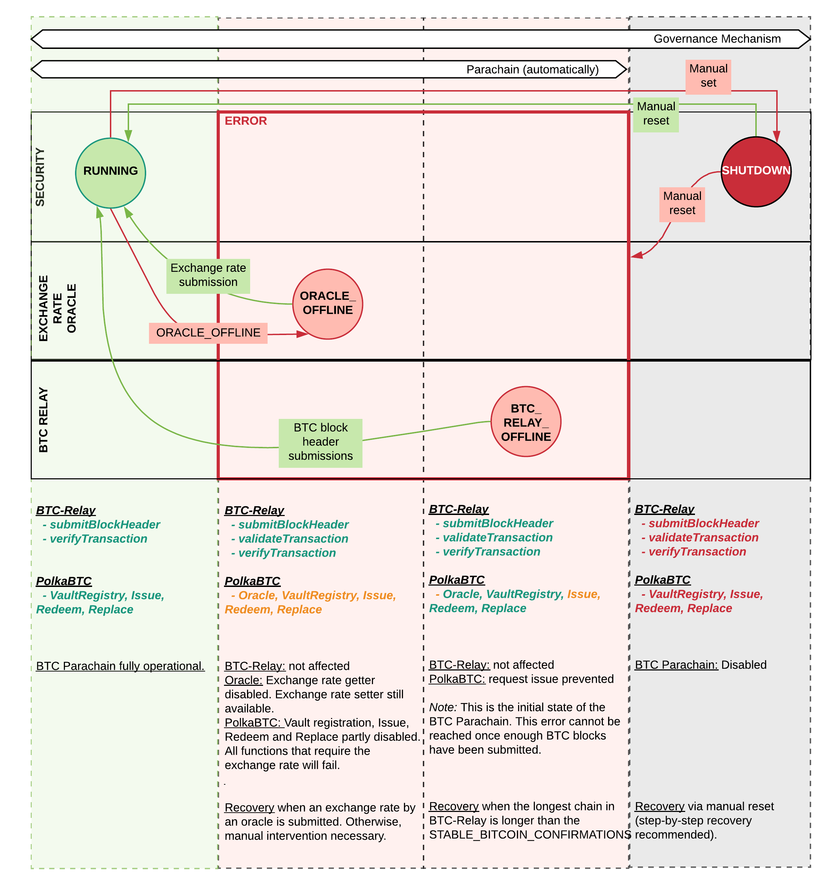

.. _security:

Security
========

The Security module is responsible for (1) tracking the status of the BTC Parachain, (2) the "active" blocks of the BTC Parachain, and (3) generating secure identifiers.

1. **BTC Parachain Status**: The BTC Parachain has three distinct states: ``Running``, ``Error``, and ``Shutdown`` which determine which functions can be used.
2. **Active Blocks**: When the BTC Parachain is not in the ``Running`` state, certain operations are restricted. In order to prevent impact on the users and vaults for the core issue, redeem, and replace operations, the BTC Parachain only considers Active Blocks for the Issue, Redeem, and Replace Periods.
3. **Secure Identifiers**: As part of the :ref:`op-return` scheme to prevent replay attacks, the security module generates unique identifiers that are used to identify transactions. 

Overview
~~~~~~~~

Failure Modes
-------------

The BTC Parachain can enter into an ERROR and SHUTDOWN state, depending on the occurred error.
An overview is provided in the figure below.

    (Informal) State machine showing the operational and failure modes and how to recover from or flag failures.

Failure handling methods calls are **restricted**, i.e., can only be called by pre-determined roles.

.. _oracle-offline-err:

Oracle Offline
--------------

The :ref:`oracle` experienced a liveness failure (no up-to-date exchange rate available).
The frequency of the oracle updates is defined in the Oracle module.

**Error code:** ``ORACLE_OFFLINE``

BTC-Relay Offline
-----------------

The :ref:`btc-relay` has less blocks stored than defined as the ``STABLE_BITCOIN_CONFIRMATIONS``.

This is the initial state of the BTC-Parachain. After more than the ``STABLE_BITCOIN_CONFIRMATIONS`` BTC blocks have been stored in BTC-Relay, the BTC Parachain cannot decide if or not it is behind in terms of Bitcoin blocks since we make no assumption about the frequency of BTC blocks being produced.

**Error code:** ``BTC_RELAY_OFFLINE``

Data Model
~~~~~~~~~~

Enums
------

StatusCode
...........
Indicates ths status of the BTC Parachain.

* ``RUNNING: 0`` - BTC Parachain fully operational

* ``ERROR: 1``- an error was detected in the BTC Parachain. See ``Errors`` for more details, i.e., the specific error codes (these determine how to react).

* ``SHUTDOWN: 2`` - BTC Parachain operation fully suspended. This can only be achieved via manual intervention by the Governance Mechanism.

ErrorCode
.........

Enum specifying error codes tracked in ``Errors``.

* ``NONE: 0``

* ``ORACLE_OFFLINE: 1``

* ``BTC_RELAY_OFFLINE: 2``

Data Storage
~~~~~~~~~~~~

Scalars
--------

ParachainStatus
...............

Integer/Enum (see ``StatusCode`` below). Defines the current state of the BTC Parachain. 

Errors
........

Set of error codes (``ErrorCode`` enums), indicating the reason for the error. The ``ErrorCode`` entries included in this set specify how to react to the failure.

Nonce
.....

Integer increment-only counter, used to prevent collisions when generating identifiers for e.g., redeem or replace requests (for OP_RETURN field in Bitcoin).

.. _activeBlockCount:

ActiveBlockCount
................

A counter variable that increments every block where the parachain status is ``RUNNING:0``. This variable is used to keep track of durations, such as issue/redeem/replace expiry. This is used instead of the block number because if the parachain status is not ``RUNNING:0``, no payment proofs can be submitted, so it would not be fair towards users and vaults to continue counting down the (expiry) periods. 

Functions
~~~~~~~~~

.. _generateSecureId:

generateSecureId
----------------

Generates a unique ID using an account identifier, the ``Nonce`` and a random seed.

Specification
.............

*Function Signature*

``generateSecureId(account)``

*Parameters*

* ``account``: Parachain account identifier (links this identifier to the AccountId associated with the process where this secure id is to be used, e.g., the user calling :ref:`requestIssue`).

*Returns*

* ``hash``: a cryptographic hash generated via a secure hash function.

Function Sequence
.................

1. Increment the ``Nonce``.
2. Concatenate ``account``, ``Nonce``, and ``parent_hash()``.
3. SHA256 hash the result of step 1.
4. Return the resulting hash.

.. note:: The funtion ``parent_hash()`` is assumed to return the hash of the parachain's parent block - which precedes the block this function is called in.

.. _hasExpired:

hasExpired
----------

Checks if the given period has expired since the given starting point. This calculation is based on the :ref:`activeBlockCount`.

Specification
.............

*Function Signature*

``has_expired(opentime, period)``

*Parameters*

* ``opentime``: the :ref:`activeBlockCount` at the time the issue/redeem/replace was opened.

* ``period``: the number of blocks the user or vault has to complete the action.

*Returns*

* ``true`` if the period has expired

Function Sequence
.................

1. Add the ``opentime`` and ``period``.
2. Compare this against :ref:`activeBlockCount`.

.. _setParachainStatus:

setParachainStatus
------------------

Governance sets a status code for the BTC Parachain manually.

Specification
.............

*Function Signature*

``setParachainStatus(StatusCode)``

*Parameters*

* ``StatusCode``: the new StatusCode of the BTC-Parachain.

.. _insertParachainError:

insertParachainError
--------------------

Governance inserts an error for the BTC Parachain manually.

Specification
.............

*Function Signature*

``insertParachainError(ErrorCode)``

*Parameters*

* ``ErrorCode``: the ErrorCode to be added to the set of errors of the BTC-Parachain.

.. _removeParachainError:

removeParachainError
--------------------

Governance removes an error for the BTC Parachain manually.

Specification
.............

*Function Signature*

``removeParachainError(ErrorCode)``

*Parameters*

* ``ErrorCode``: the ErrorCode to be removed from the set of errors of the BTC-Parachain.

Events
~~~~~~~

RecoverFromErrors
-----------------

*Event Signature*

``RecoverFromErrors(StatusCode, ErrorCode[])``

*Parameters*

* ``StatusCode``: the new StatusCode of the BTC Parachain
* ``ErrorCode[]``: the list of current errors 